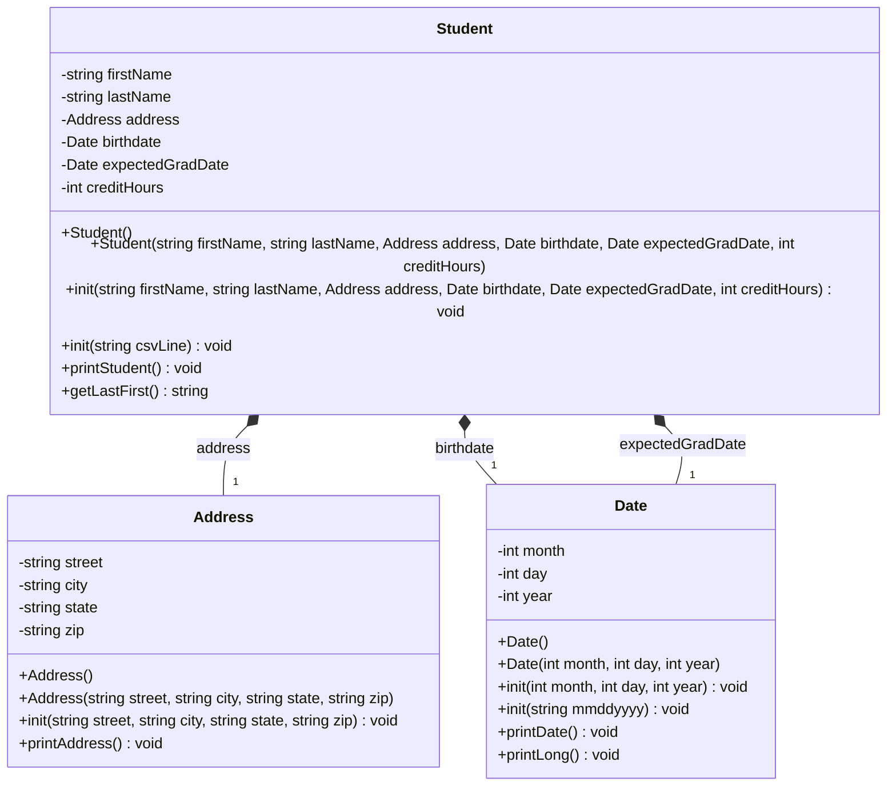

# CompSci121HeapOfStudents

```mermaid
classDiagram
    class Date {
        -int month
        -int day
        -int year
        +Date()
        +Date(int month, int day, int year)
        +init(int month, int day, int year) void
        +init(string mmddyyyy) void
        +printDate() void
        +printLong() void
    }

    class Address {
        -string street
        -string city
        -string state
        -string zip
        +Address()
        +Address(string street, string city, string state, string zip)
        +init(string street, string city, string state, string zip) void
        +printAddress() void
    }

    class Student {
        -string firstName
        -string lastName
        -Address address
        -Date birthdate
        -Date expectedGradDate
        -int creditHours
        +Student()
        +Student(string firstName, string lastName, Address address, Date birthdate, Date expectedGradDate, int creditHours)
        +init(string firstName, string lastName, Address address, Date birthdate, Date expectedGradDate, int creditHours) void
        +init(string csvLine) void
        +printStudent() void
        +getLastFirst() string
    }

    Student *-- "1" Address : address
    Student *-- "1" Date : birthdate
    Student *-- "1" Date : expectedGradDate
```
